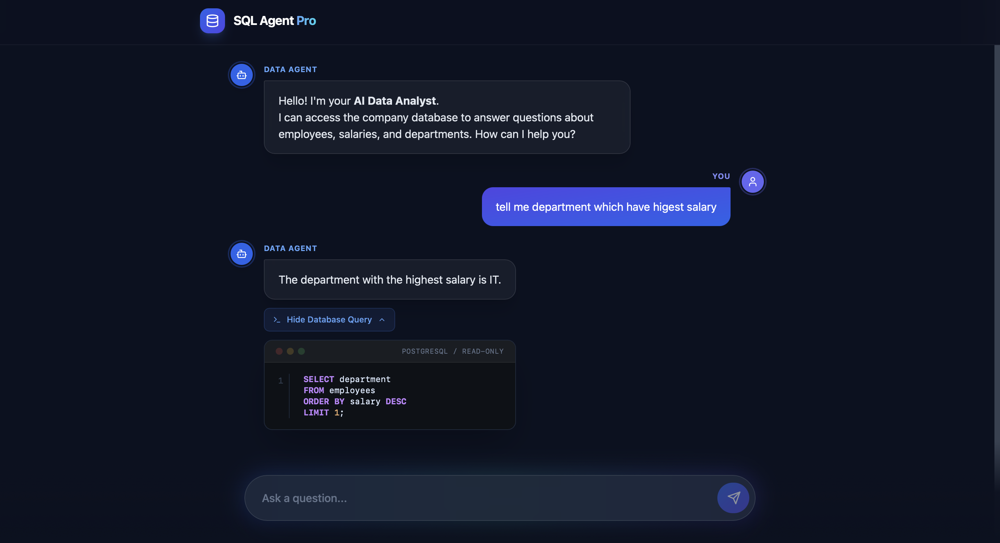
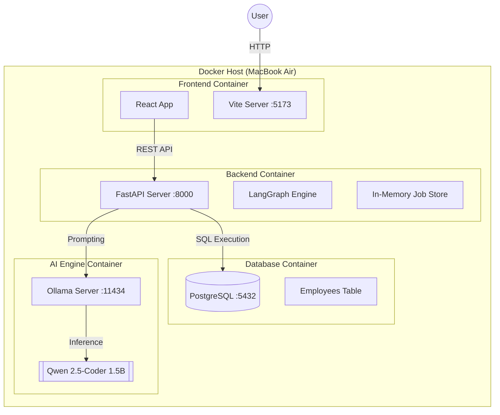
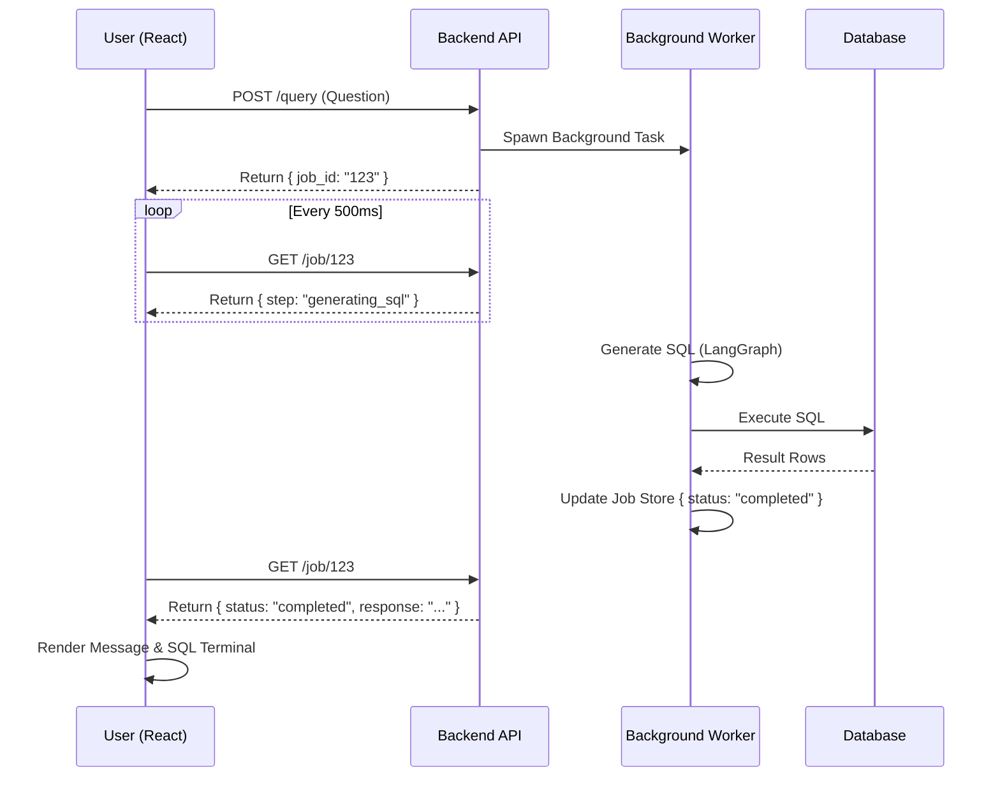
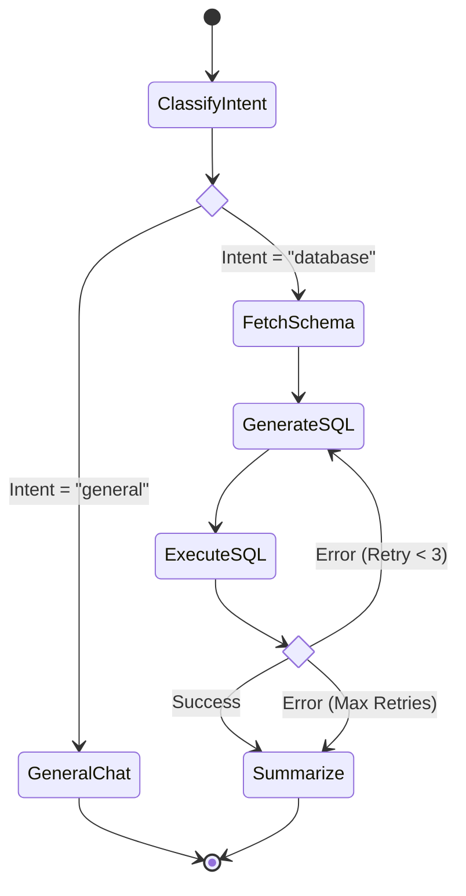
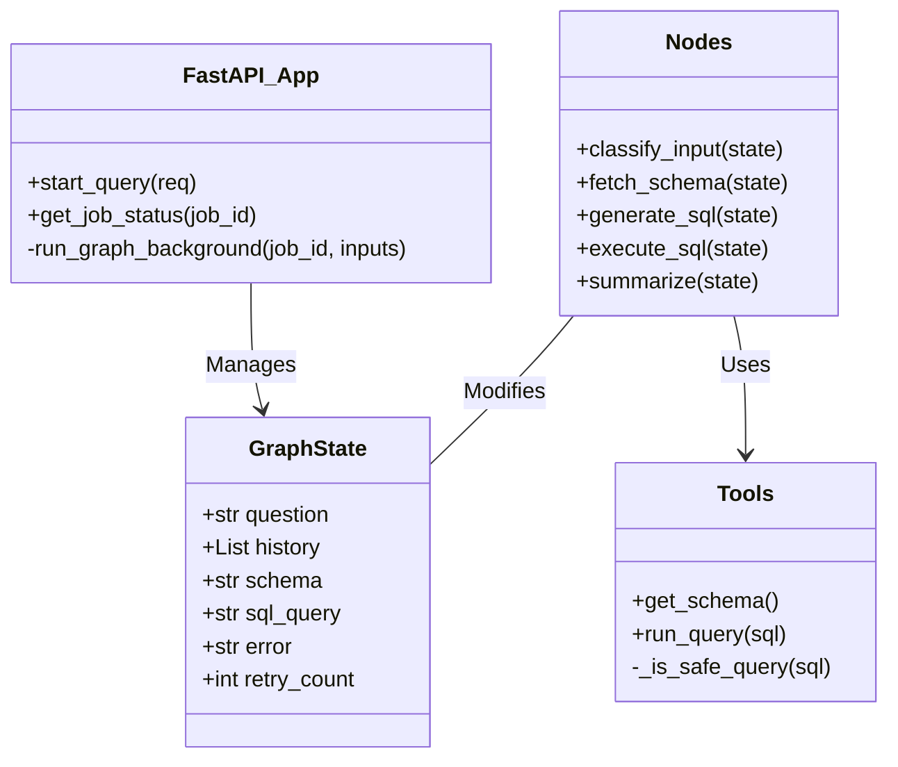
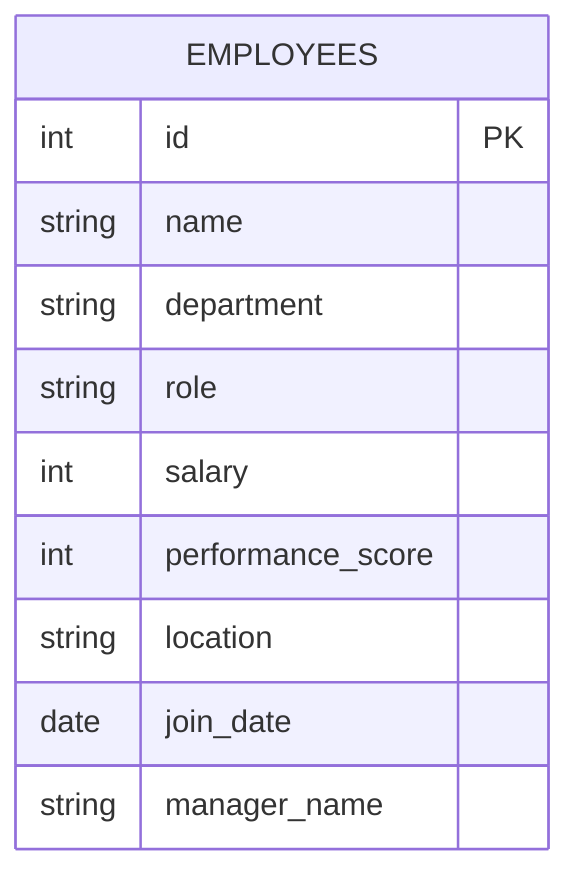

# 🤖 AI SQL Agent Pro

**A Production-Grade, Self-Correcting Text-to-SQL Agent powered by Local LLMs.**

---

### 📸 Interface Preview



> The interface features a Glassmorphic Dark Mode design with real-time state visualization, syntax-highlighted SQL terminal, and interactive thinking indicators.

---

## 📖 Executive Summary

This project implements a robust **Autonomous Database Agent** that enables non-technical users to query complex PostgreSQL databases using natural language.

Unlike simple "wrapper" tools, this agent uses a **Cognitive Architecture** (LangGraph) to:

1. **Understand Intent:** Distinguishes between casual chat and data queries.
2. **Self-Correct:** If the generated SQL fails, the agent reads the error, fixes its own code, and retries automatically.
3. **Context Aware:** Remembers conversation history to resolve pronouns (e.g., _"What is **his** salary?"_).
4. **Real-Time Observability:** The frontend polls the backend to show the user exactly what the AI is thinking step-by-step.

All AI processing happens **locally** using **Ollama (Qwen 2.5-Coder)**, ensuring 100% data privacy.

---

## 🏗️ System Architecture & UML Diagrams

### 1. Deployment Diagram

This diagram illustrates how the application is containerized and deployed using Docker Compose.



### 2. Sequence Diagram (Async Polling)

We moved from synchronous waiting to an asynchronous **Job Queue pattern** to provide a better UX.



### 3. Activity Diagram (The "Brain")

This flow shows the decision-making process inside `app/graph.py`, including the **Self-Correction Loop**.



### 4. Class Diagram (Backend Logic)

Structuring the code for modularity and type safety.



### 5. Entity Relationship Diagram (ERD)

The optimized database schema designed for efficient querying without complex joins.



---

## ⚡ Key Features

- **🛡️ Secure Guardrails:** The agent is restricted to `READ-ONLY` SQL permissions and sanitizes all inputs to prevent injection attacks.
- **🧠 Memory Injection:** The prompt dynamically retrieves the last `N` messages to maintain conversational context.
- **🏎️ Speed Optimized:** Uses the **Qwen 2.5-Coder (1.5B)** model, optimized to run on standard consumer hardware.
- **💅 Production UI:**
- Glassmorphism CSS
- Markdown Rendering
- Syntax-Highlighted SQL Terminal
- Animated "Thinking" Steps

---

## 🚀 Getting Started

### Prerequisites

- Docker & Docker Compose
- Node.js 18+ (Optional, for local dev)

### Installation

1. **Clone the repository**

```bash
git clone https://github.com/yourusername/sql-agent-pro.git
cd sql-agent-pro

```

1. **Start the Stack**

```bash
docker-compose up -d --build

```

1. **Access the Application**

- Frontend: `http://localhost:5173`
- Backend Docs: `http://localhost:8000/docs`

---

## 🛠️ Tech Stack

| Component         | Technology            | Description                                     |
| ----------------- | --------------------- | ----------------------------------------------- |
| **Frontend**      | React + Vite          | Fast, modern web framework                      |
| **Styling**       | Tailwind CSS          | Utility-first styling with custom Glassmorphism |
| **Backend**       | FastAPI (Python)      | High-performance Async API                      |
| **Orchestration** | LangChain / LangGraph | State machine for AI logic                      |
| **LLM**           | Ollama (Qwen 2.5)     | Local AI Inference                              |
| **Database**      | PostgreSQL 15         | Relational Data Store                           |

---

**Developed with ❤️ by Jaspreet**
